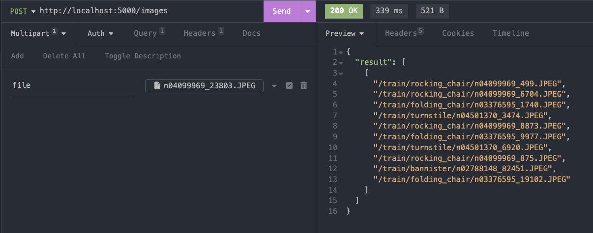
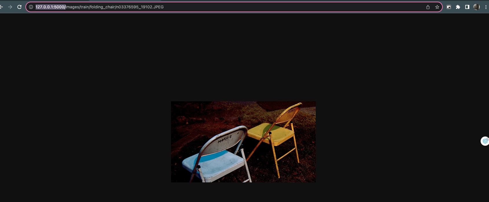

# 1. Start Flask application
```bash
 flask --app flaskr run --debug
```

# 2. Set up Vector Database
In root directory, run:
```bash
docker-compose up
```

# 3. Set up data for text search
- Create python virtural env
- Activate that virtaul env
- pip install pipenv
- cd backend
- pipenv install
- Go to flaskr/utils/import_text_data.ipynb
- Run step by step to pull and insert data into Milvus

# 4. Test Text Search API
URL: http://localhost:5000/text
Query Param: text

# 5. Set up data for image search
- Go to flaskr/utils/import_image_data.ipynb
- Run step by step to pull and insert image data into Milvus

# 6. Test Image Search API
## 6.2 Search
- Method: POST
- URL: http://localhost:5000/images
- Multipart Form Data Field: file

## 6.2 Ser Image
- Method: GET
- URL: http://localhost:5000/images/<image_path>


## 6.3 Note
- In Insomnia you can use 'http://localhost:5000' to access backend
- But on browser, must use http://127.0.0.1:500 
